# EJECUCION DEL CRUD DE PYTHON

## PRESENTACION DE MENU:
- Ejecucion:

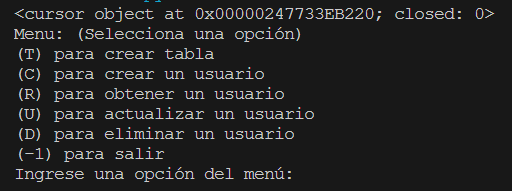
    

## CREACION TABLA:

- Antes:

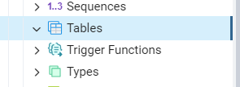

- Ejecucion:

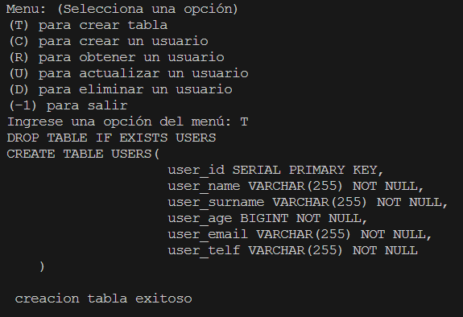

- Despues:

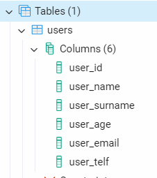
    

## CREACION DATOS (CREATE):
- Antes:

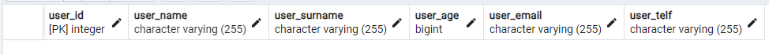

- Ejecucion:

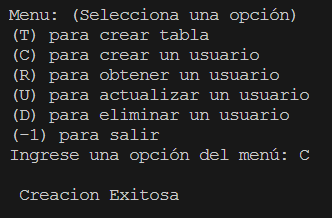

- Despues:

    

## LECTURA DATOS (READ):

- Ejecucion:

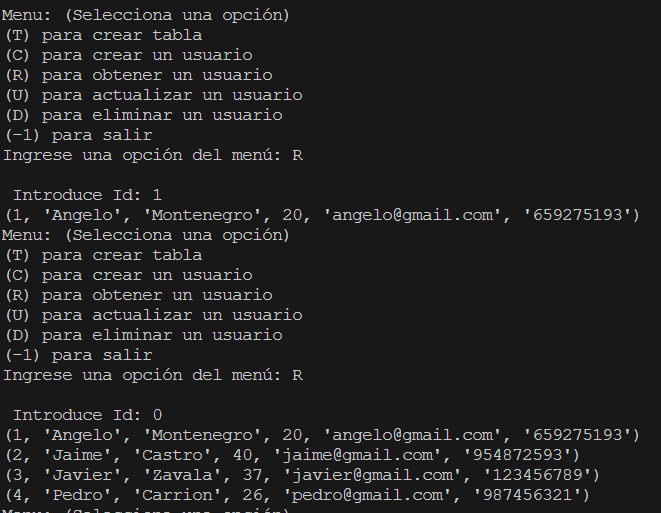

## ACTUALIZACION DATOS (UPDATE):

- Antes:

- Ejecucion:

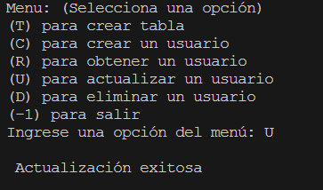

- Despues:

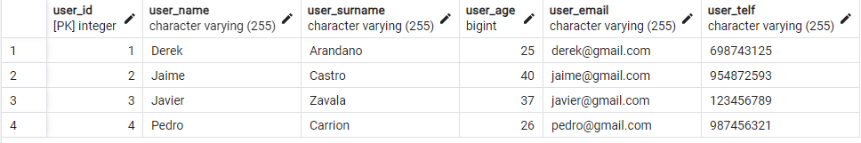

## ELIMINACION DATOS (DELETE):
- Antes:

- Ejecucion:

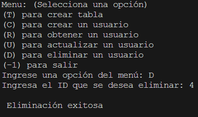

- Despues:

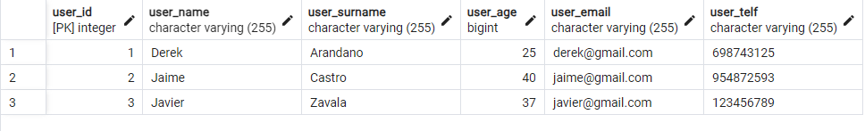

