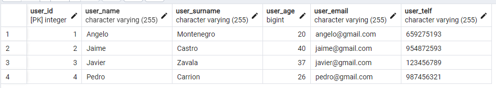

# EJECUCION DEL CRUD DE PYTHON

## PRESENTACION DE MENU:
- Ejecucion:

    

## CREACION TABLA:

- Antes:

- Ejecucion:

- Despues:

    

## CREACION DATOS (CREATE):
- Antes:

- Ejecucion:

- Despues:

    

## LECTURA DATOS (READ):

- Ejecucion:

## ACTUALIZACION DATOS (UPDATE):

- Antes:

- Ejecucion:

- Despues:

## ELIMINACION DATOS (DELETE):
- Antes:

- Ejecucion:

- Despues:

